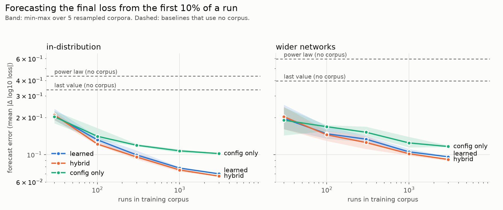

# runcast (pilot)

Does a learned forecaster of training runs follow a scaling law? This pilot generates
small teacher-student MLP training runs (numpy, CPU), then predicts each run's final
test loss from its config and its first 10% of steps, and measures how forecast error
falls as the corpus of past runs grows.

```bash
OMP_NUM_THREADS=1 uv run python -m runcast.generate 7000 out/runs.jsonl   # ~25 min on 4 cores
OMP_NUM_THREADS=1 uv run python -m runcast.forecast out/runs.jsonl out/results.json
uv run python -m runcast.plot out/results.json out/scaling.png
```



First result (7,000 runs; error = mean |Δ log10 final loss|, test sets of 1,000 runs):

| Method | In-distribution, N=3000 | Wider networks (unseen), N=3000 |
| --- | --- | --- |
| Last value (no corpus) | 0.335 | 0.395 |
| Power-law extrapolation (no corpus) | 0.432 | 0.594 |
| Learned, config only | 0.102 | 0.116 |
| Learned, config + first 10% | 0.070 | 0.096 |
| Hybrid (+ power-law feature) | 0.067 | 0.091 |

Error falls with corpus size, but the curve bends toward a floor above about 1,000 runs.
The irreducible floor (seed-to-seed spread of the final loss for a fixed config) has not
been measured yet.
